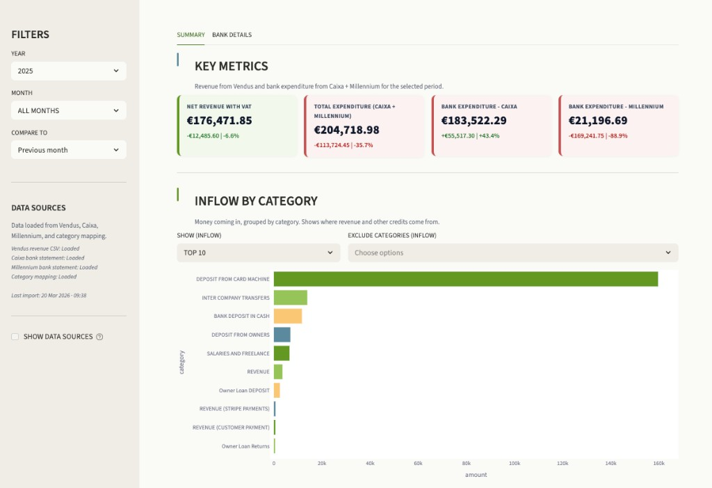
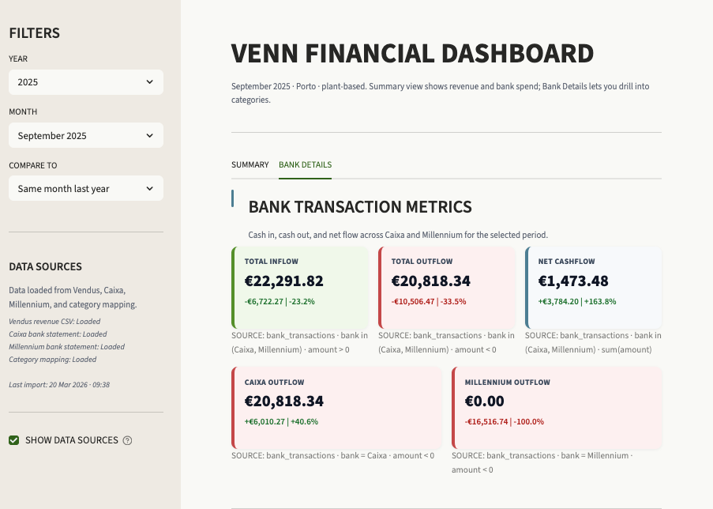

# Restaurant Financial BI — Local Dashboard

> A fully local financial intelligence system for independent restaurants.  
> Ingest your revenue exports and bank statements, categorise expenses, and explore everything through a clean Streamlit dashboard — with no data leaving your machine.

[](https://www.loom.com/share/4ed32146a9b447949a28b9745a8189aa)
[](https://www.linkedin.com/in/julian-fernandes-a1a19ba/)

---

## The problem this solves

Most independent restaurants are run by people who care deeply about what they do — the food, the team, the community they are building. What they rarely have is a clear, honest picture of the business behind it.

Revenue lives in the POS. Expenses are scattered across two bank accounts. Labour is part cash, part transfer. VAT clouds the real numbers. And the monthly accountant report arrives three weeks too late to act on.

This project connects those dots. It takes the raw exports you already have — your daily sales CSV and your bank statements — and turns them into one clean picture: what came in, what went out, which categories are growing, and whether this month was better or worse than the last.

No subscriptions. No cloud. No consultant required. Just your data, on your laptop, in a dashboard you can open every Monday morning and actually understand.

---

## What this project does

Built for a real plant-based restaurant in Porto, this is a practical, beginner-friendly BI stack that any independent hospitality business can adapt. It is intentionally simple: Python scripts, a local SQLite database, and a Streamlit dashboard.

**What you get out of the box:**

- Daily revenue loaded from your POS export (built for Vendus, adaptable to any CSV)
- Bank transactions from two accounts normalised into one clean table (built for Caixa and Millennium BCP, adaptable to any Portuguese bank)
- A category mapping system so you can label every expense — food costs, labour, utilities, loan repayments, and more
- A two-tab Streamlit dashboard with month-over-month and year-over-year comparisons
- Full audit trail so you can always trace a number back to its source row

---

## Demo

▶ [Watch the full dashboard walkthrough on Loom](https://www.loom.com/share/4ed32146a9b447949a28b9745a8189aa)

### Summary tab



### Bank Details tab



---

## Who this is for

- **Independent restaurant or café owners** who want a real picture of cash flow without paying for enterprise software
- **Developers** learning how to build a local data pipeline with Python, SQLite, and Streamlit
- **Small business operators** in any sector who have CSV exports from a POS or bank and want to make sense of them

---

## The data pipeline — four layers

Data flows through four numbered layers, each building on the last. Run them in order once, then re-run any layer when new data arrives.

```
Raw files  →  L1  →  L2  →  L3  →  L4  →  SQLite DB  →  Dashboard
```

| Layer | What it does | Input | Output |
|-------|-------------|-------|--------|
| **L1** | Ingest POS revenue exports into a clean daily CSV | Vendus CSV files | `revenue_daily.csv` |
| **L2** | Load the revenue CSV into SQLite | `revenue_daily.csv` | `revenue_daily` table |
| **L3** | Parse and normalise bank statements into SQLite | Bank CSVs (Caixa, Millennium) | `bank_transactions` table |
| **L4** | Load your category mapping into SQLite | Excel category map | `transaction_category_map` table |

Each layer writes audit reports so you can verify what was loaded and catch anything unexpected.

---

## Database schema

Everything lives in a single SQLite file at `data/warehouse/venn.db`.

### `revenue_daily`
One row per trading day from your POS system.

| Column | Type | Description |
|--------|------|-------------|
| `date` | TEXT | Trading date (primary key) |
| `sales_gross` | REAL | Revenue including VAT |
| `sales_net` | REAL | Revenue excluding VAT |
| `costs` | REAL | Costs recorded in POS |
| `profit` | REAL | Net profit from POS |
| `num_sales` | REAL | Number of transactions |
| `quantity` | REAL | Items sold |
| `source_file` | TEXT | Which CSV this row came from |
| `imported_at` | TEXT | When this row was loaded |

### `bank_transactions`
Every bank transaction from all accounts, normalised to a common schema.

| Column | Type | Description |
|--------|------|-------------|
| `id` | INTEGER | Primary key |
| `account_id` | TEXT | Which account |
| `bank` | TEXT | Bank name (Caixa / Millennium) |
| `posted_date` | TEXT | Date transaction cleared |
| `value_date` | TEXT | Date transaction initiated |
| `description_raw` | TEXT | Original bank description |
| `description_norm` | TEXT | Normalised description for matching |
| `amount` | REAL | Negative = outflow, positive = inflow |
| `balance` | REAL | Running account balance |
| `currency` | TEXT | EUR |
| `source_file` | TEXT | Which statement file |
| `source_row` | INTEGER | Row number in source file |
| `imported_at` | TEXT | When this row was loaded |

### `transaction_category_map`
Maps bank transaction descriptions to your expense categories.

| Column | Type | Description |
|--------|------|-------------|
| `id` | INTEGER | Primary key |
| `description_norm` | TEXT | Matches `bank_transactions.description_norm` |
| `category` | TEXT | e.g. Labour, Cost of Goods, Overheads |
| `subcategory` | TEXT | e.g. Employees, Fresh Produce, Utilities |
| `source_label` | TEXT | Supplier or payee name |
| `notes` | TEXT | Optional context |
| `updated_at` | TEXT | When this mapping was last updated |

---

## Category structure

Expenses are organised into four top-level groups, each with categories and subcategories.

| Group | Categories |
|-------|-----------|
| **Cost of Goods** | Fresh Produce, Bakery/Flours, Drink Suppliers, Bulk Suppliers, Supermarkets |
| **Labour** | Employees (Contract), Employees (Cash), Freelancers, Social Security |
| **Overheads** | Rent, Utilities, Loan Repayment, Bank Fees, Software & Systems, Incubation Fees, Governmental Fees |
| **Other** | Packaging, Photography, Transport, Miscellaneous, Construction & Equipment |

The category mapping lives in an Excel file (`data/partner_input/venn_category_mapping.xlsx`) that you fill in and re-load whenever you have new suppliers or want to reclassify a transaction. A template generator script creates a fresh copy pre-populated with all unmapped transaction descriptions.

---

## Dashboard

Run with:
```bash
streamlit run app.py
```

Opens at `http://localhost:8501`.

### Sidebar controls
- **Year** — filter to a specific year
- **Month** — select a single month or view all months
- **Compare to** — previous month or same month last year
- **Data sources** — toggle to show or hide which DB table each metric pulls from

### Summary tab
- Four KPI cards: Net Revenue (with VAT), Total Expenditure, Caixa Expenditure, Millennium Expenditure
- Each card shows the value, a signed delta (e.g. +€290 | +1.5%), and the comparison period
- Inflow by category — bar chart with TOP 5 / TOP 10 / ALL controls and category exclusion
- Outflow by category — same controls

### Bank Details tab
- Two KPI rows: inflow / outflow / net, then Caixa vs Millennium split
- Inflow transactions by category — expandable groups, largest first
- Outflow transactions by category — expandable groups, largest first
- Individual transactions visible inside each group

---

## Project structure

```
.
├── app.py                          # Streamlit dashboard entrypoint
├── requirements.txt                # Python dependencies
├── .streamlit/
│   └── config.toml                 # Dashboard theme (warm neutral palette)
│
├── scripts_orchestrator/           # Run these — one script per layer
│   ├── L1_vendus_csv_ingest_revenue.py
│   ├── L2_load_revenue_to_sqlite.py
│   ├── L3_load_bank_to_sqlite.py
│   ├── L4_load_category_map_to_sqlite.py
│   └── L4_generate_partner_mapping_template.py
│
├── scripts_pipeline/                # Reusable logic (imported by scripts)
│   ├── layers/                     # Layer-aligned entrypoints — read these first
│   │   ├── l1_revenue.py
│   │   ├── l2_revenue_sqlite.py
│   │   ├── l3_bank_sqlite.py
│   │   └── l4_category_sqlite.py
│   ├── db.py                       # SQLite connection helper
│   ├── schema.py                   # Table and index definitions
│   ├── paths.py                    # Centralised file paths
│   ├── revenue_ingest.py           # L1 parsing logic
│   ├── revenue_sqlite.py           # L2 load logic
│   └── bank_sqlite.py              # L3 load logic
│
├── ingest/                         # Bank statement parsers
│   ├── common.py                   # Shared normalisation helpers
│   ├── caixa.py                    # Caixa Geral parser
│   └── millennium.py               # Millennium BCP parser
│
├── dashboard/
│   └── data_prep.py                # All SQL queries for the dashboard
│
├── data/                           # ← gitignored — local outputs only
│   ├── warehouse/                  # venn.db lives here
│   ├── reports/                    # Audit CSVs
│   └── partner_input/              # Category mapping Excel files
│
└── raw_docs/                       # ← gitignored — your actual bank/POS files
    ├── venn_revenue/               # Vendus CSV exports
    └── bank_statements/            # Bank statement CSVs
        ├── account_1-Caixa-Geral-Depositos/
        └── account_2-Millennium-bcp/
```

---

## Setup

### 1. Clone the repo
```bash
git clone https://github.com/your-username/restaurant-bi.git
cd restaurant-bi
```

### 2. Create a virtual environment
```bash
python3 -m venv .venv
source .venv/bin/activate          # macOS/Linux
# .venv\Scripts\activate           # Windows
```

### 3. Install dependencies
```bash
pip install --upgrade pip
pip install -r requirements.txt
```

### 4. Add your data

Create the folders that are gitignored and add your own files:

```bash
mkdir -p raw_docs/venn_revenue
mkdir -p raw_docs/bank_statements/account_1-Caixa-Geral-Depositos
mkdir -p raw_docs/bank_statements/account_2-Millennium-bcp
mkdir -p data/warehouse data/reports data/partner_input
```

Then copy your:
- Vendus CSV exports → `raw_docs/venn_revenue/`
- Caixa CSV statements → `raw_docs/bank_statements/account_1-Caixa-Geral-Depositos/`
- Millennium CSV statements → `raw_docs/bank_statements/account_2-Millennium-bcp/`

### 5. Run the pipeline
```bash
# Layer 1 — build clean revenue CSV
python scripts_orchestrator/L1_vendus_csv_ingest_revenue.py

# Layer 2 — load revenue into SQLite
python scripts_orchestrator/L2_load_revenue_to_sqlite.py

# Layer 3 — load bank statements into SQLite
python scripts_orchestrator/L3_load_bank_to_sqlite.py

# Layer 4 — generate category mapping template
python scripts_orchestrator/L4_generate_partner_mapping_template.py
# → fill in data/partner_input/venn_category_mapping_TEMPLATE.xlsx
# → save as data/partner_input/venn_category_mapping.xlsx
# → then load it:
python scripts_orchestrator/L4_load_category_map_to_sqlite.py
```

### 6. Launch the dashboard
```bash
streamlit run app.py
```

---

## Adapting this for your business

This project was built for one specific restaurant but designed to be adapted. Here is what you would need to change for a different business:

### Different POS system
The revenue ingestion in `L1` expects Vendus CSV exports with columns `Day`, `Sales with VAT`, and `Sales`. If your POS exports differently, update `scripts_pipeline/revenue_ingest.py` — the rest of the pipeline is unchanged.

### Different bank
The bank parsers in `ingest/caixa.py` and `ingest/millennium.py` handle the specific CSV formats those banks export. Add a new file `ingest/yourbank.py` following the same pattern, then register it in `scripts_pipeline/layers/l3_bank_sqlite.py`.

### Different categories
Edit `data/partner_input/venn_category_mapping.xlsx` and re-run L4. The category structure (group → category → subcategory) is flexible — add as many rows as you need.

### Different currency
Amounts are stored as raw numbers. Update the display format in `dashboard/data_prep.py` and `app.py` from `€` to your currency symbol.

---

## Audit reports

Every layer writes CSV reports to `data/reports/` so you can verify what was loaded.

| Report | What it tells you |
|--------|-------------------|
| `revenue_daily_audit.csv` | Summary stats for loaded revenue data |
| `revenue_daily_duplicates.csv` | Any duplicate dates found |
| `revenue_daily_missing_days.csv` | Trading days with no revenue recorded |
| `revenue_sqlite_audit.csv` | Comparison of CSV vs SQLite totals |
| `bank_transactions_audit.csv` | Row counts, date range, amount totals per account |
| `bank_transactions_duplicates.csv` | Transactions that were skipped as duplicates |
| `bank_transactions_unparsed_rows.csv` | Rows the parser could not read |
| `transaction_category_coverage_audit.csv` | How many transactions have a category vs not |
| `transaction_category_unmapped.csv` | Transactions still needing a category assigned |

---

## Reading the code (learning order)

All modules use a beginner-friendly `# what / why / how` comment style. If you are new to Python data pipelines, read in this order:

| Step | File | What you learn |
|------|------|----------------|
| 1 | `scripts_pipeline/paths.py` | How file paths are managed centrally |
| 2 | `scripts_pipeline/db.py` | How to open a SQLite connection |
| 3 | `scripts_pipeline/schema.py` | How tables and indexes are defined |
| 4 | `scripts_pipeline/layers/l1_revenue.py` | How CSV files are read and validated |
| 5 | `scripts_pipeline/layers/l2_revenue_sqlite.py` | How data is upserted into SQLite |
| 6 | `ingest/common.py` → `ingest/caixa.py` | How messy bank CSVs are normalised |
| 7 | `scripts_pipeline/layers/l3_bank_sqlite.py` | How two sources merge into one table |
| 8 | `dashboard/data_prep.py` | How SQL queries feed a dashboard |
| 9 | `app.py` | How Streamlit renders it all |

---

## Key dependencies

| Package | Version | Why |
|---------|---------|-----|
| `pandas` | ≥2.0 | Data loading, transformation, and audit logic |
| `streamlit` | ≥1.28 | Dashboard UI |
| `plotly` | ≥5.0 | Interactive charts |
| `xlrd` | latest | Legacy Excel file compatibility |
| `openpyxl` | latest | Modern Excel file read/write |

Install all with:
```bash
pip install -r requirements.txt
```

---

## Privacy and data

All sensitive data is gitignored. The following never leave your machine and are never committed to version control:

- `raw_docs/` — your actual bank statements and POS exports
- `data/` — the SQLite database and all generated reports
- `*.db`, `*.sqlite`, `*.sqlite3` — any database files
- `.env` — API keys

Only code is committed. Your financial data stays local.

---

## What is built, what is next

### Done
- [x] L1 — Vendus revenue CSV ingestion
- [x] L2 — Revenue to SQLite
- [x] L3 — Bank statements (Caixa + Millennium) to SQLite
- [x] L4 — Category mapping to SQLite
- [x] Dashboard — Summary tab with KPI cards and charts
- [x] Dashboard — Bank Details tab with category drill-down
- [x] Audit reports for every layer
- [x] Beginner-friendly code comments throughout

### Planned
- [ ] Credit card PDF ingestion (L5)
- [ ] Cash payments tracking
- [ ] Sales page — day-of-week analysis, seasonal trends
- [ ] Costs page — category breakdown over time
- [ ] Cash flow page — runway, burn rate, big payment calendar
- [ ] Health flags — automatic alerts when labour % or COGS % exceed targets
- [ ] Predictive trends — 3-month rolling revenue projection

---

## About the builder

**Julian Fernandes** — Berlin-based data analyst and CRM specialist.

[](https://www.linkedin.com/in/julian-fernandes-a1a19ba/)

After completing a 12-week intensive data analytics bootcamp at Ironhack — covering Python, SQL, data visualisation, and statistical thinking — Julian has been focused on one thing: taking those foundations out of the classroom and applying them to real problems that real businesses face.

This project is that in practice. With a background in CRM strategy and customer data, Julian understands the commercial questions that matter — which costs are growing, which months are genuinely profitable, where the money actually goes — and has built the technical skills to answer them directly from source data rather than waiting for someone else to.

Long-time supporter of VENN, a 100% plant-based canteen in Porto, Julian built this dashboard to solve a problem he saw up close: a passionate, mission-driven small business with no clear financial picture. The result is a pipeline that goes from raw bank exports to an interactive dashboard, built incrementally, documented for anyone to follow, and designed to be adapted for any independent business facing the same challenge.

Throughout this project, AI tools were used as a thinking partner and learning accelerator — to work through architectural decisions faster, debug unfamiliar patterns, and build something that would otherwise require a much larger team. That approach is reflected openly in how the project is structured and documented.

> *"The Ironhack bootcamp gave me the fundamentals. Real business problems gave me the reason to use them."*

---

## Licence

MIT — use it, adapt it, build on it.  
If you build something with this for your own restaurant or business, a mention or a ⭐ on the repo is always appreciated.

---

*Built with Python, SQLite, and Streamlit. Runs entirely on your laptop.*
